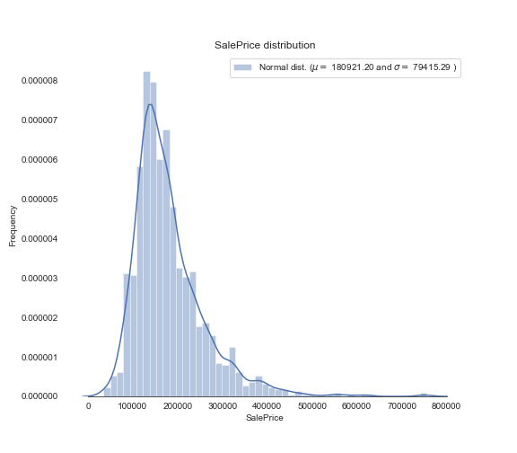

在特征工程阶段，探索数据分析EDA是必不可少的部分。通过这一阶段对数据的观察分析，可以对数据的分布做一个宏观的了解，为后面数据的修正和调整确定一个基本的方向。

首先是对预测属性的数据观察
```
sns.set_style("white")
sns.set_color_codes(palette='deep')
f, ax = plt.subplots(figsize=(8, 7))

sns.distplot(train['SalePrice'], color="b");
ax.xaxis.grid(False)
ax.set(ylabel="Frequency")
ax.set(xlabel="SalePrice")
ax.set(title="SalePrice distribution")
sns.despine(trim=True, left=True)
plt.show()
```

