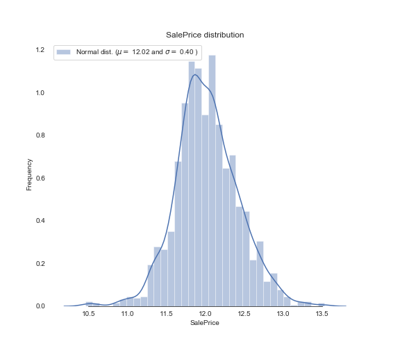

在特征工程阶段，探索数据分析EDA是必不可少的部分。通过这一阶段对数据的观察分析，可以对数据的分布做一个宏观的了解，为后面数据的修正和调整确定一个基本的方向。

首先是对预测属性的数据观察
```
sns.set_style("white")
sns.set_color_codes(palette='deep')
f, ax = plt.subplots(figsize=(8, 7))
#Check the new distribution 
sns.distplot(train['SalePrice'], color="b");
(mu, sigma) = norm.fit(train['SalePrice'])
print( '\n mu = {:.2f} and sigma = {:.2f}\n'.format(mu, sigma))
plt.legend(['Normal dist. ($\mu=$ {:.2f} and $\sigma=$ {:.2f} )'.format(mu, sigma)],
            loc='best')
ax.xaxis.grid(False)
ax.set(ylabel="Frequency")
ax.set(xlabel="SalePrice")
ax.set(title="SalePrice distribution")
sns.despine(trim=True, left=True)
plt.savefig("/Users/slyrx/slyrxStudio/github_good_projects/Tech_Blog/assets/images/sale_price_distribut.png")
plt.show()
```


将此时的正态分布的斜度和峭度输出
```
print("Skewness: %f" % train['SalePrice'].skew())
print("Kurtosis: %f" % train['SalePrice'].kurt())
```
    Skewness: 1.882876
    Kurtosis: 6.536282
通常来说，我们期望数据分布能更加的趋于标准的正态分布，也就是说斜度和峭度能够更加的趋于：

    Skewness: 0
    Kurtosis: 3
那么，我们后续的努力就将朝着这个方向进行。从技术处理的角度来讲，对正态分布偏斜的修正使用对数函数log(1+x)进行修正。
```
train["SalePrice"] = np.log1p(train["SalePrice"])
```
我们再来看修正后的预测属性分布：
```
sns.set_style("white")
sns.set_color_codes(palette='deep')
f, ax = plt.subplots(figsize=(8, 7))

sns.distplot(train['SalePrice'], color="b");

(mu, sigma) = norm.fit(train['SalePrice'])
print( '\n mu = {:.2f} and sigma = {:.2f}\n'.format(mu, sigma))
plt.legend(['Normal dist. ($\mu=$ {:.2f} and $\sigma=$ {:.2f} )'.format(mu, sigma)],
            loc='best')
ax.xaxis.grid(False)
ax.set(ylabel="Frequency")
ax.set(xlabel="SalePrice")
ax.set(title="SalePrice distribution")
sns.despine(trim=True, left=True)
plt.savefig("/Users/slyrx/slyrxStudio/github_good_projects/Tech_Blog/assets/images/sale_price_distribut_fixed.png")
plt.show()
```
